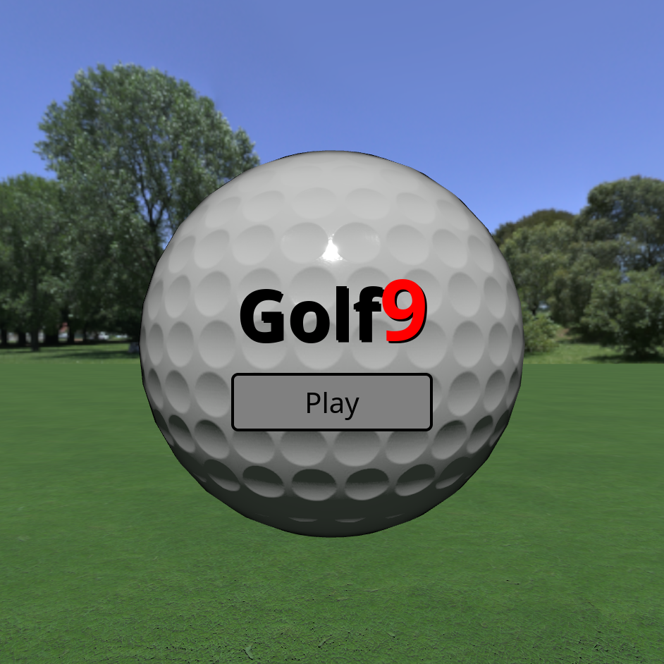
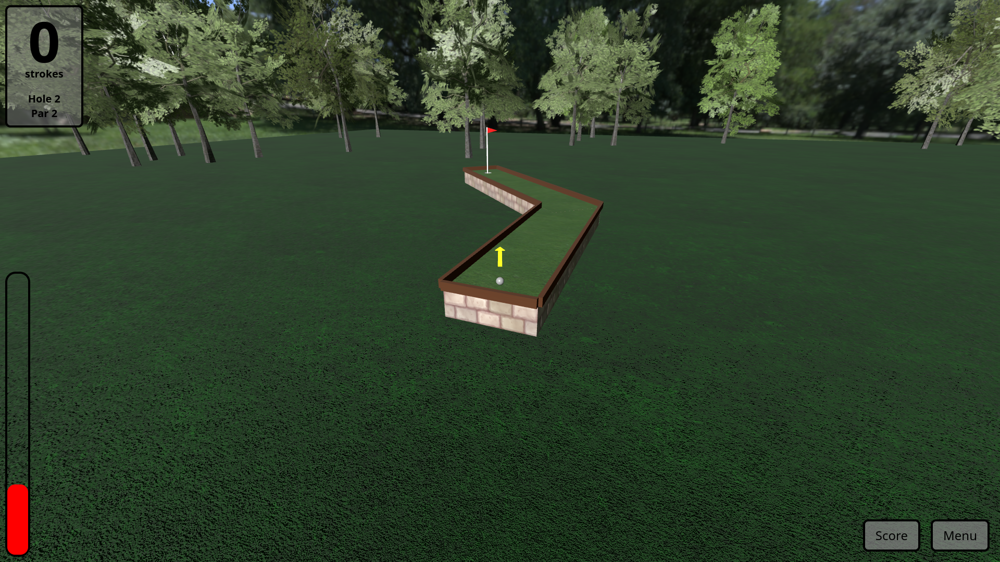
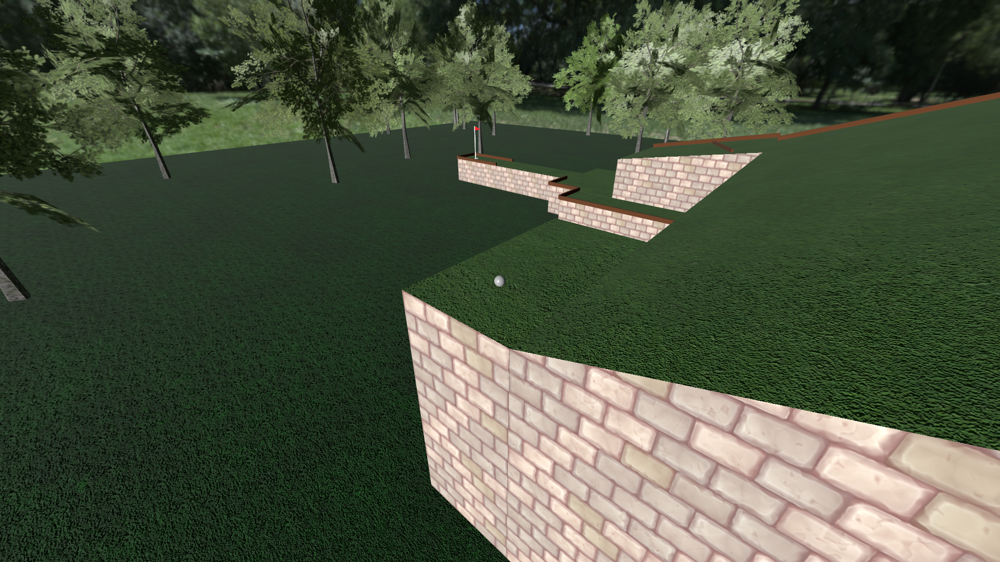
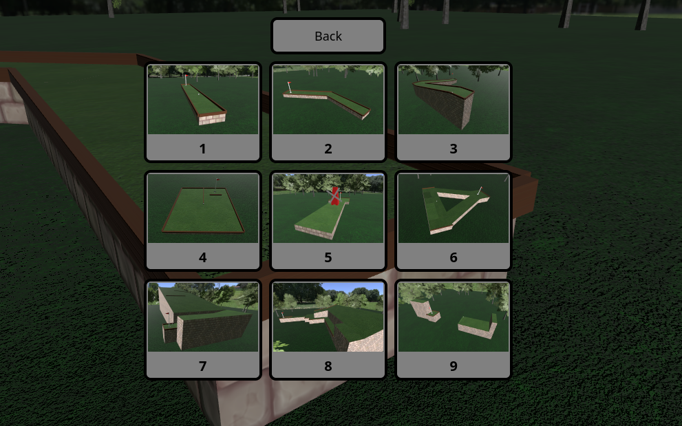

# Golf 9 
A browser based 9-hole minigolf game written in Javascript.

## Play

Golf 9 can be played at https://jsanborn.dev/putt/  
The game features 9 holes which if completed consecutively allow you to submit your score with your name on the leaderboard.

## 3rd party libraries
three.js - for 3d graphics and audio
cannon-es - for 3d physics simulation
three-csg - for simplifying hole geometry generation
