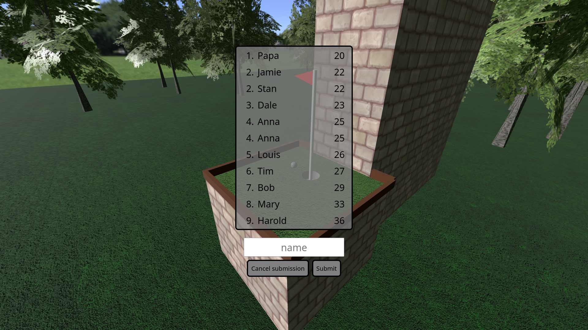

# Golf 9 
A browser based 9-hole minigolf game written in Javascript.

## Play

Golf 9 can be played at https://jsanborn.dev/putt/  

The game features 9 holes which if completed consecutively allow you to submit your score with your name on the leaderboard.

## 3rd party libraries
[three.js](https://github.com/mrdoob/three.js/) - for 3d graphics and audio  
[cannon-es](https://github.com/pmndrs/cannon-es) - for 3d physics simulation  
[three-csg](https://github.com/samalexander/three-csg-ts) - for simplifying hole geometry generation  
